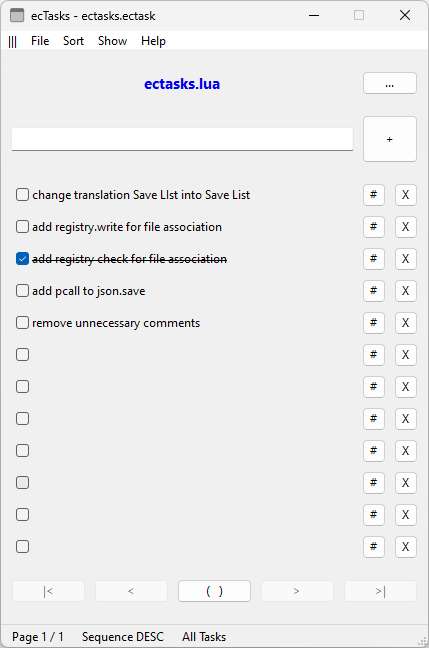

# ec-file-tools

 a collection of small file tools

## ecTasks

You can use the ecTasks application to create a task list and link it to a file. This allows you to manage all your specific tasks on a file basis. You can add, edit and delete tasks. You can also navigate, sort and filter all your tasks.

